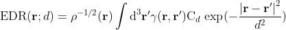
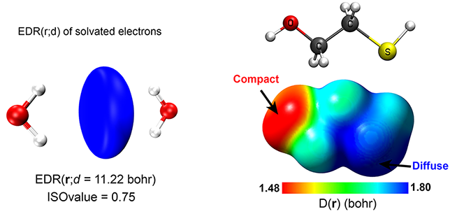

EDRcal
===

This FORTRAN based code calculates the Electron Delocalization Range Function EDR(**r**;*d*), and Orbital Overlap Distance Function D(**r**) on entire molecule and generate output in Gaussian `.cub` file. Currently, it accepts the wavefunction in `.wfn`, `.wfx` file format that can be generated by nearly all mainstream quantum chemistry softwares. It also supports Gaussian formatted checkpoint files `.fch` and `.fchk`.

## Basic Workflow

* Obtain `.wfn`, `.wfx`, `.fch` or `.fchk` files from a standard quantum chemistry calculation
* Boot up EDRcal and input the file generated in previous step
* Generate the total electron density `.cub` file by selecting the grid size
* Similarly, generate the overlap distance D(**r**) `.cub` file by selecting the EDR(**r**;*d*) exponents (default is OK)
* EDR(**r**;*d*) `.cub` can also be generated similarly by using appropriate length scale *d*  
* The obtained EDR(**r**;*d*) can be visualized using the common visualizers such as GaussView, VMD, [Avogadro](https://github.com/cryos/avogadro) etc., by choosing proper ISOvalue
* The D(**r**) can be used to map the obtained total electron density using standard ISOvalue of 0.001 e/bohr3.

## How to Compile
### Binary Package
The pre-compiled binary files for Win64 and Linux 64-bit are provided in bin folder. These are parallel versions and will use all available processors.
### Source Code
The source code is provided in src folder along with `Makefile` which can be used to compile by using either Intel `ifort` and `MPI` Library or equally using `GNU Fortran` with `OpenMPI` libraries. Uncomment your favorite compiler section and hit `make`.

 ## Theoretical Details

The Electron Delocalization Range Function, EDR(**r**;*d*), quantifies the extent to which an electron at point **r** in a calculated wave function overlaps over distance *d*. It is constructed from the one-particle density matrix γ(**r**,**r**')=Σini*ψ*i(**r**)*ψ*i(**r**') of molecular orbitals *ψ*i with nonzero occupancy ni. At each point **r**, its overlap is evaluated with an s-orbital-like test function C*d* exp(−|**r** – **r**'|2/*d*2) centered at point **r** and having width *d*:

The orbital overlap distance D(**r**) is the distance *d* that maximizes EDR(**r**;*d*) at point **r**. When plotted on molecular isosurfaces such as electron or spin density surfaces, D(**r**) distinguishes the compact regions on the surface of molecule from those regions which are relatively diffuse. Correspondingly, the chemically "hard" regions tend to give small D(**r**), whereas chemically "soft" regions tend to give larger D(**r**). For example, the figure on right shows that sulfur in mercaptoethanol is diffuse due to large value of D(**r**) relative to the chemically hard i.e., compact oxygen which has smaller value of D(**r**). Similarly, the left figure shows the EDR(**r**;*d*) of solvated electrons highlighting that the extra electron is delocalized in the center of two H2O molecules.

For further details, please see the following publications.

1. Janesko, B. G.;  Scalmani, G.; Frisch, M. J., [How Far Do Electrons Delocalize?](https://aip.scitation.org/doi/abs/10.1063/1.4897264?journalCode=jcp) *J. Chem. Phys.* **2014**, *141*, 144104.
2. Janesko, B. G.;  Wiberg, K. B.;  Scalmani, G.; Frisch, M. J., [Electron Delocalization Range in Atoms and on Molecular Surfaces.](https://pubs.acs.org/doi/10.1021/acs.jctc.6b00343) *J. Chem. Theory Comput.* **2016**, *12*, 3185–3194.  
3. Mehmood, A.; Janesko, B. G., [An Orbital-Overlap Complement to Atomic Partial Charge.](https://onlinelibrary.wiley.com/doi/abs/10.1002/anie.201702715) *Angew. Chem. Int. Ed.* **2017**, *56*, 6878-6881.
4. Mehmood, A.;  Jones, S. I.;  Tao, P.; Janesko, B. G., [An Orbital-Overlap Complement to Ligand and Binding Site Electrostatic Potential Maps.](https://pubs.acs.org/doi/10.1021/acs.jcim.8b00370) *J. Chem. Inf. Model.* **2018**, *58*, 1836-1846.
5. Mehmood, A.; Janesko, B. G., [Extending the Marcus μ-Scale of Solvent Softness Using Conceptual Density Functional Theory and the Orbital Overlap Distance: Method and Application to Ionic Liquids.](https://link.springer.com/article/10.1007/s10953-020-00973-5) *J. Solution Chem.* **2020**, *49*, 614–628.

## Technical Notes and Manuals

These tools can also be evaluated by using [Multiwfn](http://sobereva.com/multiwfn/) or cubegen utility of [Gaussian 16](https://gaussian.com/gaussian16/). Our research [group page](https://janeskoresearchgroup.wordpress.com/) provides the technical notes for calculations using [Multiwfn](https://janeskoresearchgroup.files.wordpress.com/2020/07/multiwfn-calculating-overlap-distance.pdf) and [Gaussian 16](https://janeskoresearchgroup.files.wordpress.com/2020/07/gaussian-16-calculating-overlap-distance.pdf).